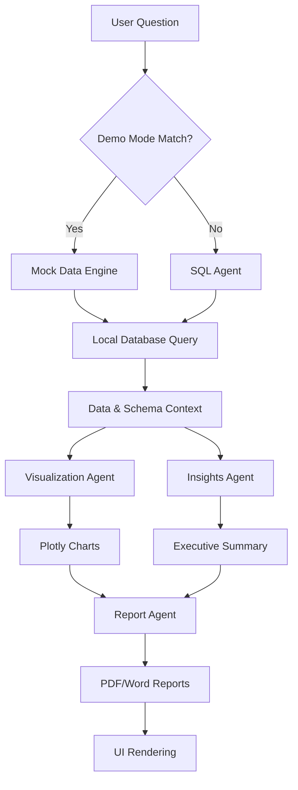

# 🏗️ IntelliQuery AI Architecture

This document explains the internal design and data flow of IntelliQuery AI. The platform uses a **Multi-Agent Orchestration** pattern to transform natural language into business intelligence.

## 🔄 The Pipeline (Orchestrator)
Everything is coordinated by the `Orchestrator`. When a user asks a question, it flows through these stages:

## 🤖 Specialized Agents

| Agent | Responsibility | Tooling |
| :--- | :--- | :--- |
| **SQL Agent** | Translates Text -> SQL & Validates security | LangChain + Groq (Llama 3) |
| **Visualization Agent** | Selects and generates the best chart type | Plotly + Data Analysis |
| **Insights Agent** | Extracts business trends and recommendations | LLM-based analysis |
| **Report Agent** | Compiles results into downloadable documents | FPDF + Python-Docx |

## 📂 Project Structure

- `app.py`: The Main Entry Point. Handles Streamlit state and high-level routing.
- `src/agents/`: Brains of the application. Contains all LLM-powered logic.
- `src/ui/`: Presentation Layer. Reusable Streamlit components.
- `src/database/`: Persistence Layer. SQLite connection and schema management.
- `src/config/`: Configuration. Centralized settings and environment validation.

## 🔒 Security & Reliability
1. **SQL Guardrails**: Forbidden keywords (DROP, DELETE, etc.) are blocked via regex before execution.
2. **Dialect Pinning**: Strictly uses SQLite syntax to prevent cross-database errors.
3. **Demo Mode**: Intercepts sample queries to ensure the app works 100% offline without API keys.
