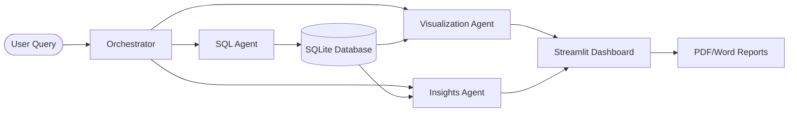

# 🏙️ IntelliQuery AI
### Executive Business Intelligence & Natural Language Analytics

IntelliQuery AI is a modern BI platform that transforms natural language questions into strategic business insights using Multi-Agent Orchestration. Built for performance, security, and local-first privacy.

---

## 🚀 Key Features

- **Multi-Agent Brain**: Independent agents for SQL generation, data visualization, and executive insights.
- **Provider Choice**: Seamlessly switch between **Local LLM (Ollama)** for privacy or **Cloud LLM (Groq)** for speed.
- **Executive Dashboard**: Professional dark-themed UI with glassmorphism aesthetics.
- **Auto-Reporting**: Generate downloadable PDF and DOCX executive summaries instantly.
- **Privacy First**: Support for fully offline execution with Ollama.

## 🛠️ Architecture



## ⚙️ Quick Start

### 1. Prerequisite
- Python 3.9 or higher
- (Optional) [Ollama](https://ollama.ai/) for local execution

### 2. Setup
Clone the repository and run the setup script:
```powershell
.\setup.ps1
```

### 3. Launch
Start the platform:
```powershell
.\run.ps1
```

## 📂 Configuration

Edit the `.env` file to customize your setup:
- `LLM_PROVIDER`: `ollama` (Local) or `groq` (Cloud)
- `LLM_MODEL`: `llama3` or `mixtral-8x7b-32768`
- `OLLAMA_BASE_URL`: Defaults to `http://localhost:11434`

## 🧪 Verification
Run the integrated test suite to verify the pipeline:
```powershell
pytest tests/ -v
```

---
*Built with ❤️ for Executive Business Intelligence.*
